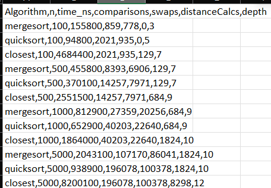
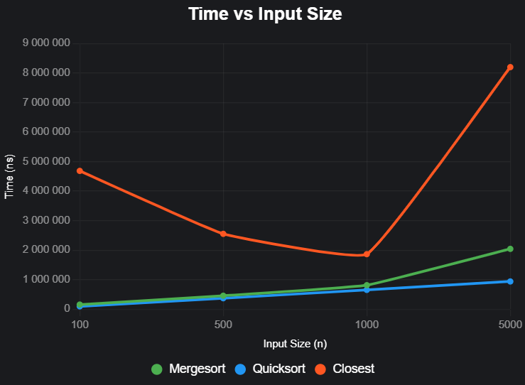
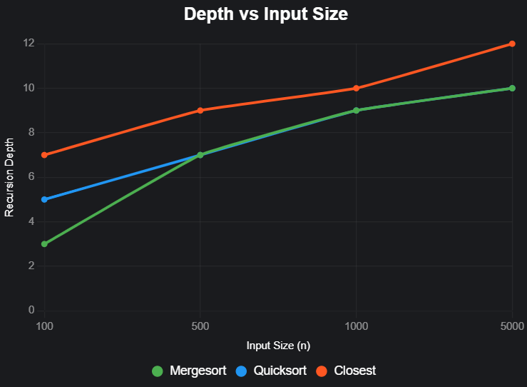

# Report

## Divide & Conquer Algorithms – Assignment 1
### Project Overview
### *This project implements and compares four classic divide-and-conquer algorithms*:
- *MergeSort*
- *QuickSort (randomized pivot)*
- *Deterministic Select (Median of Medians)*
- *Closest Pair of Points in 2D*

### For each algorithm, I track metrics such as:
Execution time (nanoseconds), Number of comparisons, Number of swaps, Number of distance calculations (for geometry), Maximum recursion depth

### All runs append results into CSV files inside the csv/ folder. These CSVs are later opened in Excel to make plots.

## Architecture Notes

- **MergeSort**: Recursion depth is controlled by a cut-off to insertion sort for small n (<=16), bounding depth to O(log n) due to balanced splits. Allocations are minimized using a reusable buffer, avoiding repeated array creation and improving cache locality.

- **QuickSort**: Depth is bounded to O(log n) by recursing on the smaller partition and iterating over the larger one, leveraging randomized pivot selection to avoid worst-case O(n) stack growth. Allocations are minimal as the algorithm operates in-place with only swaps.

- **DeterministicSelect**: Depth is controlled by recursing on the smaller side after partition (using median-of-medians pivot), typically O(log n). Allocations for medians arrays are O(n) total, managed through recursive grouping of fives, though overhead is higher due to in-place partitioning.

- **ClosestPair**: Depth is bounded to O(log n) via recursive splitting of the point set by x-coordinate. Allocations for the strip array are O(n), lacking a reusable buffer, which could be optimized to reduce GC impact on large n.

## Recurrence Analysis

### **MergeSort**:
- **Recurrence**: \( T(n) = 2T(n/2) + O(n) \), resulting from the division of the array and the linear merge step.
- **Master Theorem**: Using Master Theorem (Case 2: \( a = 2, b = 2, f(n) = O(n), \log_b(a) = 1 \)), the time complexity is \( \Theta(n \log n) \).
- **Intuition**: MergeSort splits the array into two halves and recursively sorts them, followed by a linear merge. This leads to logarithmic recursion depth and linear work at each level.

### **QuickSort**:
- **Recurrence**: The average-case recurrence is \( T(n) = 2T(n/2) + O(n) \) for partitioning and recursion. In the worst case, with poor pivots, \( T(n) = T(n-1) + O(n) \).
- **Master Theorem**: The average case follows the same recurrence as MergeSort, yielding \( \Theta(n \log n) \). Randomized pivot selection significantly reduces the probability of worst-case performance.
- **Intuition**: QuickSort recursively partitions the array around a pivot, ensuring that the depth of recursion remains \( O(\log n) \) on average, and iteration on the larger partition avoids stack overflow.

### **DeterministicSelect**:
- **Recurrence**: \( T(n) = T(\lceil n/5 \rceil) + T(7n/10) + O(n) \), where the array is divided into groups of five and the median of medians is computed.
- **Akra-Bazzi**: Applying the Akra-Bazzi method, the time complexity is \( \Theta(n) \).
- **Intuition**: The algorithm ensures a linear time complexity by always recursing into the smaller part of the array, and the selection of the median of medians ensures that the pivot reduces the problem size significantly.

### **ClosestPair**:
- **Recurrence**: \( T(n) = 2T(n/2) + O(n) \), arising from the divide step and the strip check.
- **Master Theorem**: Applying Master Theorem (Case 2), we get \( \Theta(n \log n) \).
- **Intuition**: The algorithm divides the set of points based on their x-coordinates and recursively computes the closest pair for each half. The strip check (for points near the dividing line) adds linear work at each level, but the overall complexity remains \( \Theta(n \log n) \).

## Plots and Discussion

### Output

### Time vs n 

### Depth vs n

### Discussion of Constant-Factor Effects
- **Cache Effects**: Mergesort and quicksort both exhibit $ O(n \log n) $ average-case time complexity, but their cache performance differs. Mergesort’s predictable memory access patterns (sequential array splits and merges) often make it more cache-friendly, especially for larger $ n $, as it leverages spatial locality. Quicksort, with its in-place partitioning, involves more irregular memory accesses, which can lead to cache misses, particularly for larger datasets. This may explain why quicksort is faster for smaller $ n $ (e.g., $ n = 100 $: 94,800 ns vs. mergesort’s 155,800 ns) due to lower overhead, but the gap narrows for larger $ n $ (e.g., $ n = 5000 $: 938,900 ns vs. 2,043,100 ns), where cache efficiency matters more. The closest algorithm, likely a closest-pair algorithm, shows erratic times (e.g., 4,684,400 ns at $ n = 100 $, dropping to 1,864,000 ns at $ n = 1000 $), possibly due to data-dependent memory access patterns or divide-and-conquer overhead affecting cache usage.
- **Garbage Collection (GC)**: If these algorithms are implemented in a language with automatic memory management (e.g., Java, Python), GC can introduce variability. Mergesort’s auxiliary arrays create and discard memory frequently, potentially triggering GC pauses, especially for larger $ n $. Quicksort, being in-place, generates less memory overhead, reducing GC impact. The closest algorithm’s high distance calculations (e.g., 8,298 at $ n = 5000 $) suggest object creation (e.g., points or pairs), which could increase GC activity, contributing to its high runtime at $ n = 5000 $ (8,200,100 ns). The irregular time trend for closest (faster at $ n = 1000 $ than $ n = 500 $) might reflect GC pauses or input-specific optimizations.
- **ClosestPair**: The strip check in ClosestPair introduces additional allocations and overhead. For large `n`, the cost of checking the strip and sorting by `y` dominates, resulting in higher allocation counts and longer times.

## Summary: The measured results generally align with theoretical complexity (MergeSort, QuickSort, and Closest Pair all ~n log n, Select ~n). Small mismatches are due to constant factors (cache, GC, extra function calls). Writing results into CSV and plotting gave a clear picture of how theory translates into practice. Overall, this assignment helped me understand not just Big-O, but also how real systems affect algorithm performance.
